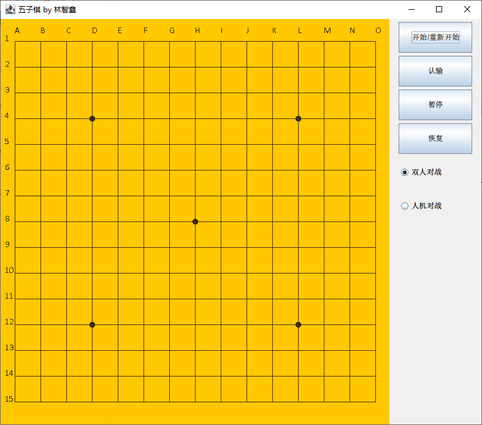
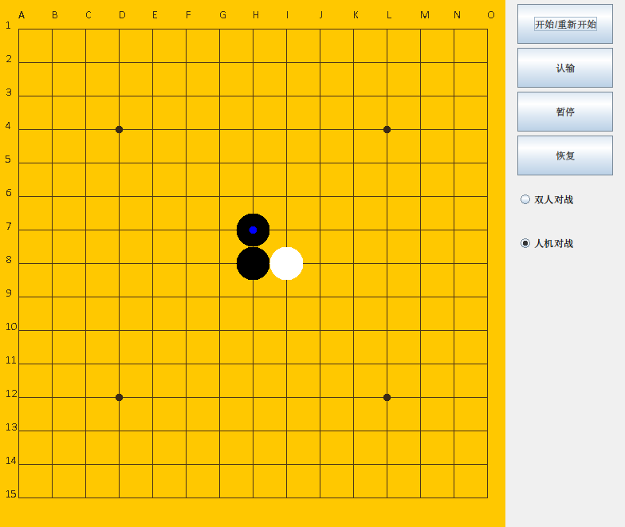

# Gomoku

More detailed Chinese doc: [中文文档](README_CN.md)

The term project of the Java Programming course in 2021 autumn.

Implement the function of player-player and player-ai competition, with an AI with good skills(It can **always** defeat my friends who never learn about related theory. But it can not promise winning when taking black.). 

feature:
* game: friendly interaction.
* AI: Alpha-Beta pruning with heuristic evaluation function. The implement focuses on ideas instead of tricks.

ScreenShot:

## Evaluation function

## TODO

1. Use iterative deepening search.

2. The original version hardcode texts in the UI. It can be better if moving that into a resource file.

3. Provide English version document. That is, to translate `REPORT_CN.md`.
