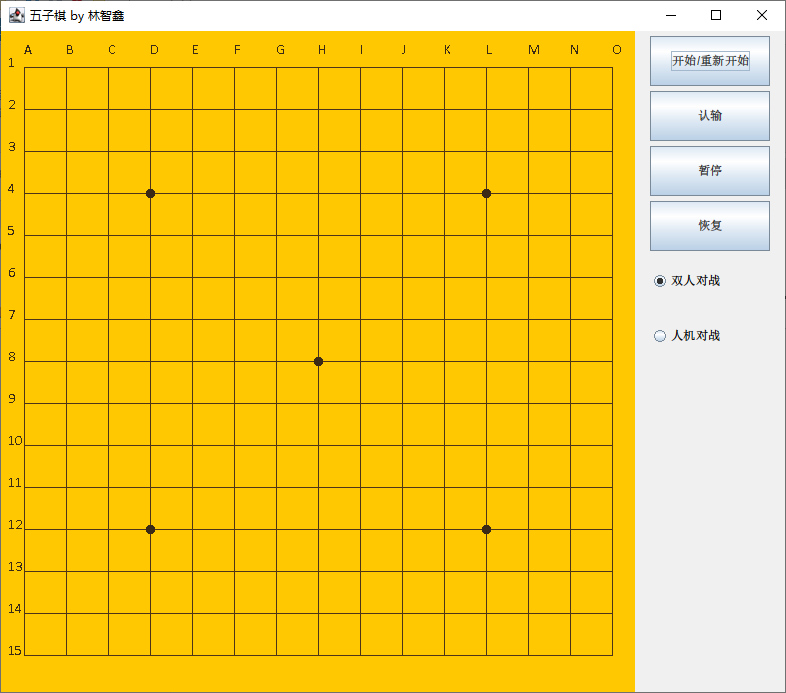

# 1. 游戏操作方式

## 1.1. 棋局开始前

打开游戏后，界面如下：



棋盘大小可调，且比例任意。

默认选中「双人对战」模式。可点击单选按钮切换模式。切换模式会导致当前棋局清空。

点击「开始/重新开始」按钮开始一场新的棋局。

## 1.2 棋局进行中

只有棋局进行中时才能在棋盘上落子。

「认输」、「暂停」、「恢复」三个按钮也只在棋局进行中时有效。

若按下「认输」，则游戏结束，对方获胜。

若按下「暂停」，则在 恢复 或 重新开始 之前，无法在棋盘上落子。

「恢复」可解除「暂停」的效果。

### 1.2.1 双人对战

由于双人对战是本地双人对战，因此不提供猜先。

棋局开始后，黑方先走。在棋盘交叉点上点击落子。

直至分出胜负，或平局。

### 1.2.2 人机对战

点击「人机对战」单选按钮，然后按「开始/重新开始」按钮。

在棋局正式开始前，会有等概率猜先。

之后流程类似，认输、暂停等按钮也可使用。

## 1.3 棋局结束

保留棋局最终状态，但不能再落子。

可以切换模式与重新开始。

# 2. 架构与设计

#### 配置

`Config`：设置了编程中需要用到的一些常数。如默认窗口大小，「黑・白・空」三种状态的表述，等等。

#### UI

`UIFrame`：对应整个窗口。在其中创建了下面3个类的实例对象。

`UIChessboardPanel`：绘制棋盘和棋子

`UIControlPanel`：生成右侧的按钮

`GomokuListener`：负责UI相关的逻辑处理。多个类的实例对象为其成员变量。根据用户的操作，调用其他类的对象实现所需操作。

#### 与UI无关的纯逻辑

`Chessboard`：逻辑棋盘。落子、撤销落子、判断胜负等逻辑都在该类中实现。

`AI`：对外只提供一个在指定棋盘（逻辑棋盘）上下棋的接口。

# 3. 实现的功能和加分项

## 3.1 基本功能

### 3.1.1 游戏界面

`UIFrame`类：对应整个窗口。

`UIChessboardPanel`类：绘制棋盘和棋子。

`UIControlPanel`类：右侧的按钮们

`GomokuListener`类：UI相关的逻辑处理（`Gomoku`即五子棋）

亮点：

1. 可以任意改变窗口大小，而一切仍能正常使用，界面也不会变形；
   思路：绘制棋盘与棋子时，数值由窗口大小计算得到，而不写死。
   代码：`void UIChessboardPanel.paint(Graphics)`

2. 棋盘横纵有数字、字母标记；

3. 棋盘上有5个圆点辅助定位；

4. 最后落下的棋子有蓝点定位。

### 3.1.2 游戏流程控制 & 游戏玩法 & 游戏结算

`GomokuListener`类：处理UI相关的游戏逻辑。

4个按钮的逻辑实现：`GomokuListener.actionPerformed(...)`

猜先：只有「人机对战」模式有猜先。

人类玩家落子处理：`GomokuListener.mouseClicked(...)`

AI落子：
人类玩家落完子后，可立刻看到刚落下的子，不必等到AI下完才能看到。

游戏结算：包括胜利方的颜色。人机对战模式下还会额外指出是「AI获胜」还是「人类玩家获胜」。

### 3.1.3 游戏规则

`Chessboard`类：一个抽象的棋盘，与UI解耦。

主要有`判断目标位置能否落子`、`落子`、`撤销落子`、`判断胜负`、`历史棋步`等功能。

## 3.2 提高功能

描述你的设计与实现，以及对应实现在源代码中的位置

## AI

对应代码：`AI`类。

棋力：至少最终的成品我下不赢了……

### 设计：

#### 对外接口

`void thinkAndAct(Chessboard chessboard)`，负责在`chessboard`上落子。

#### 搜索算法

Alpha-Beta剪枝+启发式搜索。

代码：`int think(int alpha, int beta, int depth)`

```
alpha：下界，估值比这低的棋步不值得走
beta：上界，估值比这高的棋，对手理应阻止
返回值：当前局面评分
```

`think`函数内部流程的简单表述：

```c
生成当前局面所有可行步。
为每个棋步进行估值。
根据估值结果降序排序棋步。//较优的节点靠前有利于剪枝，提高效率。即启发式搜索
若无需进一步搜索：//即达到预期深度，或棋步的估值反映已经获胜（添上后者可大大提高效率。很可能是因为搜索过程中会经常遇到分出胜负的节点）
    将最优棋步的估值作为局面分数返回
遍历可行步：
    落子
    value = -think(-beta, -alpha, depth - 1);//深入一层搜索。由于落完一子后身份交替，因此添加符号，并交换上下界
	撤销落子
	//此时，得到了走这步棋的估值。而棋盘恢复原状
    若剪枝://即估值超过了上界。这步棋过于好，对手理论上必阻止
        return value
	若估值高于之前的棋步：
        更新最优估值与Alpha-Beta搜索的上下界
//考虑完了全部可行步
return 最优估值
```

#### 棋步生成

代码：`void generateLegalMoves(int i)`

思路：

一般下五子棋只会在现有棋子周围下，不会远离战场。因此只考虑现有棋子旁边的点足矣。

这样的话，前后2个局面的可行步很可能相差不大，可在上一局面的可行步的基础上，生成当前局面的可行步。

即：`下一步可能下棋的点（新） = 下一步可能出现的点（旧） - 刚下的点 + 刚下的点旁边的点`.

「刚下的点」要检查它是否在旧可行步里，「刚下的点旁边的点」要检查它是否与已有的重复。

#### 估值函数

（经过实践后，个人认为这部分比搜索算法要难处理得多。）

代码：`void evaluateOnePos(int[] pos)`

思路：

五子棋里，走一步棋只会影响到以其为中心的横竖斜四个方向，估值时可考虑只关注这4个方向的变化。即将问题分解到如何为一个串（由落下的子+前四后四共9个子构成）估值。

（下列估值的细节思路较大程度上借鉴了各路网络资料）

五子棋中比较重要的直线特征有活三活四等等，可以通过判断串里是否有这些特征来进行赋值。这些特征的数量有限，可以提前在程序中打表。较强的特征的估值应远大于较弱的特征，如1个活四理应胜过4个活三。

四个方向总的估值之和，作为该棋步的估值。

注：估值函数里，无需从对手的角度估值再相减。「对手的角度」已经在AlphaBeta搜索的身份交换里体现了。
